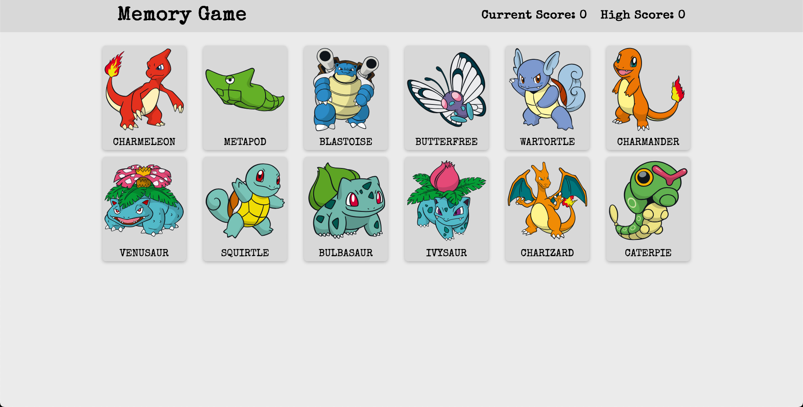

# Memory Card

> [Live Link](https://nudd3.github.io/memory-card-game/) 

## About

Memory game where the player is faced with 12 cards and is tasks to click on all of them. After a card is pressed the layout is randomly shuffled and if ther player presses an already pressed card, the game is reset. Goal is to have pressed each and every card once.

This project has responsive design to fit different devices.

Main objective for this project was to improve my skills in React as well as using APIs. For this project I've used [PokeAPI](https://pokeapi.co).

## Screenshot

## Technologies

- HTML
- CSS/SCSS
- JavaScript
- React
- PokeAPI

## Potential Improvements

- Difficulty Increase once game is done
